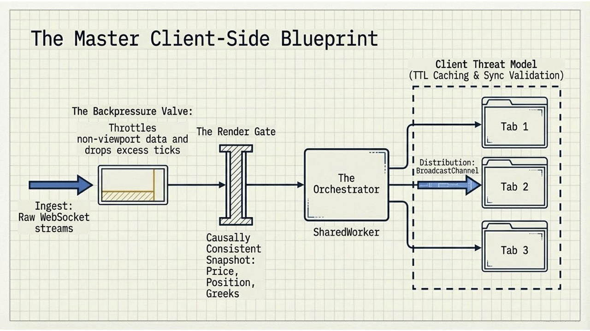
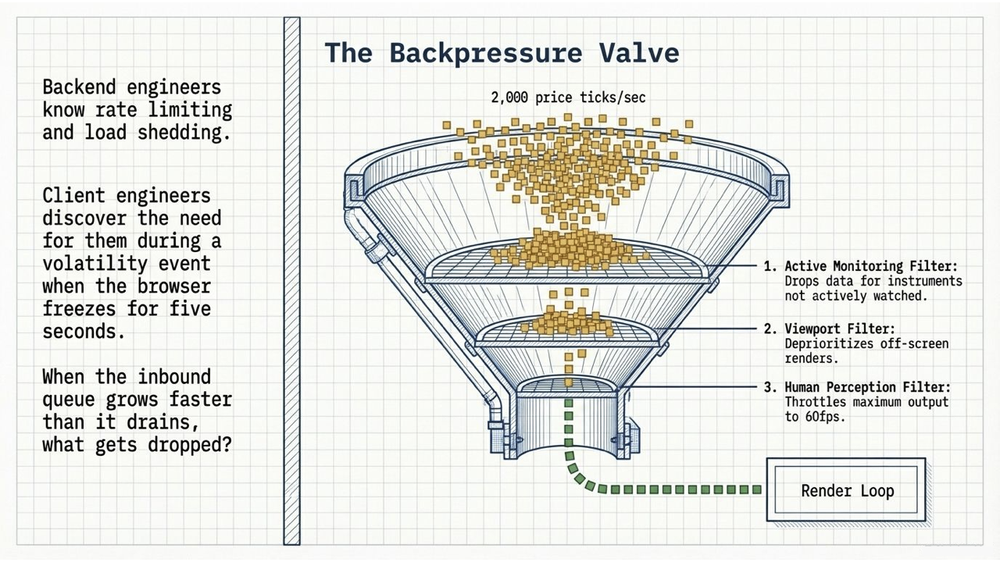
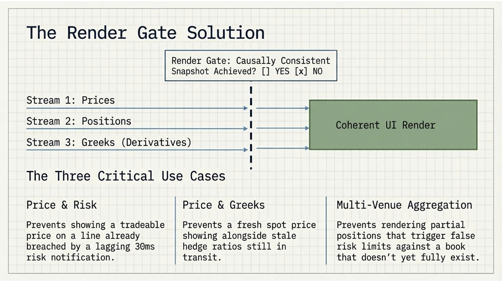
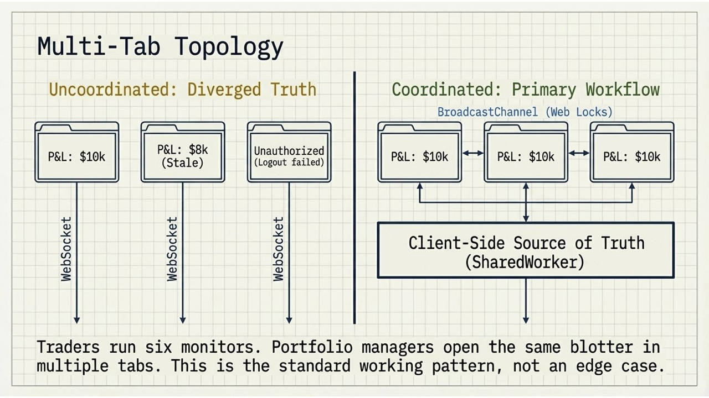

# Trading UI Pipeline

A high-performance client-side architecture for real-time trading interfaces: shared-worker orchestration offloads the main thread, a backpressure valve conflates high-frequency ticks to display frame rate, and a render gate enforces causal consistency before every snapshot reaches the UI.

## Motivation

This boilerplate aims to solve the most difficult [frontend architecture problems nobody solves before production](https://www.linkedin.com/pulse/six-frontend-architecture-problems-nobody-solves-before-ka%C5%82ka-fdo2e/) in real-time trading UIs.

## Architecture



### Pipeline stages

#### BackpressureValve

Viewport-aware conflation. Throttles 2,000 ticks/sec to 60fps for visible instruments.



#### RenderGate

Coherence enforcement. Holds render until streams are causally consistent.



#### SharedWorker & BroadcastChannel

Single WebSocket connection shared across all tabs. Distributes coherent snapshots to every open tab simultaneously.



### Stream freshness semantics

| Stream    | passThrough | Meaning                                                               |
| --------- | ----------- | --------------------------------------------------------------------- |
| prices    | `true`      | Valid-until-superseded. Last known price is correct until next tick.  |
| positions | `false`     | Invalid-if-stale. Must carry the triggering causal key (latest fill). |
| greeks    | `false`     | Invalid-if-stale. Must reflect the latest reprice.                    |

## Configuration

```typescript
import { RenderGate } from "./render-gate";
import { byCorrelationId } from "./types";

const gate = new RenderGate(
  (snapshot) => {
    /* distribute to consumers */
  },
  {
    // Choose your coherence strategy:
    coherenceKey: byCorrelationId, // or byEventTimestamp, byGlobalSequence

    streams: {
      prices: { passThrough: true },
      positions: { passThrough: false },
      greeks: { passThrough: false, gapStrategy: "snapshot-fetch" },
    },

    // p99 tail latency of your slowest downstream service
    holdTimeout: 200,
  },
);
```

### Coherence strategies

| Strategy           | Use when                                             | Properties                                                                 |
| ------------------ | ---------------------------------------------------- | -------------------------------------------------------------------------- |
| `byCorrelationId`  | Backend stamps all fan-out messages with a shared ID | Cleanest. No time arithmetic. Requires backend instrumentation.            |
| `byEventTimestamp` | Feed provides exchange-originating timestamps        | Works without backend modification. Fragile to pipeline time substitution. |
| `byGlobalSequence` | Sequenced feeds (Solace, AMPS)                       | Most general. Requires gap detection config.                               |

### Wall-clock fallback

When messages lack causal metadata, the extractor returns `null` and the gate automatically falls back to v0.1.0 wall-clock behaviour (50ms window). This makes v0.2.0 backwards-compatible with uninstrumented feeds.

## React Usage

```tsx
const { snapshot, connectionStatus } = useTradingStream({
  instrumentIds: [instrumentId],
  viewportIds: isVisible ? [instrumentId] : [],
});

if (!snapshot) return <Skeleton />;

const price = snapshot.prices[instrumentId];
const position = snapshot.positions[instrumentId];
const pnl =
  price && position ? (price.mid - position.avgCost) * position.quantity : null;
```

## Backend Requirements

v0.2.0 identity-based coherence requires the backend to stamp messages with causal metadata:

```json
{
  "stream": "positions",
  "payload": {
    "instrumentId": "AAPL",
    "quantity": 100,
    "avgCost": 150.25,
    "currency": "USD",
    "timestamp": 1700000000000,
    "correlationId": "FILL-456"
  }
}
```

All messages produced by the same market event must share the same `correlationId` (or `eventTimestamp` / `globalSequence`). The frontend uses this to determine which messages are causally related.

If your feed does not yet emit causal metadata, the wall-clock path buys time while instrumentation is added.

## Running Tests

```bash
npm test
```

The test suite includes:

- **D1**: Proves false coherence under v0.1.0 wall-clock, correct rejection under v0.2.0
- **D2**: Proves false incoherence under v0.1.0, no suppression under v0.2.0
- **D3**: Supersession (rapid fills before previous resolves)
- **D4**: Wall-clock fallback compatibility
- **D5**: Hold timeout behaviour
- **D6**: passThrough semantics
- **D7**: Gap detection (globalSequence)
- **D8**: Alternative coherence strategies
- **D9**: Snapshot correctness (sequenceId, record-copy safety, shallow-reference leak)
- **D10**: Multi-instrument coherence
- **D11**: Destroy cleanup

## File Structure

```
src/
  types.ts                    — Domain types, CausalMetadata, extractors, StreamConfig
  render-gate.ts              — Core coherence gate (causal + wall-clock fallback)
  render-gate.test.ts         — 29 tests proving correctness
  backpressure-valve.ts       — Viewport-aware tick conflation
  orchestrator.worker.ts      — SharedWorker: single WS, pipeline wiring
  client-bridge.ts            — Tab-side interface to the SharedWorker
  react/
    use-trading-stream.ts     — React hook for coherent snapshot consumption
```

## Author

- [Przemyslaw Kalka](https://www.linkedin.com/in/przemyslawkalka/?locale=en)
